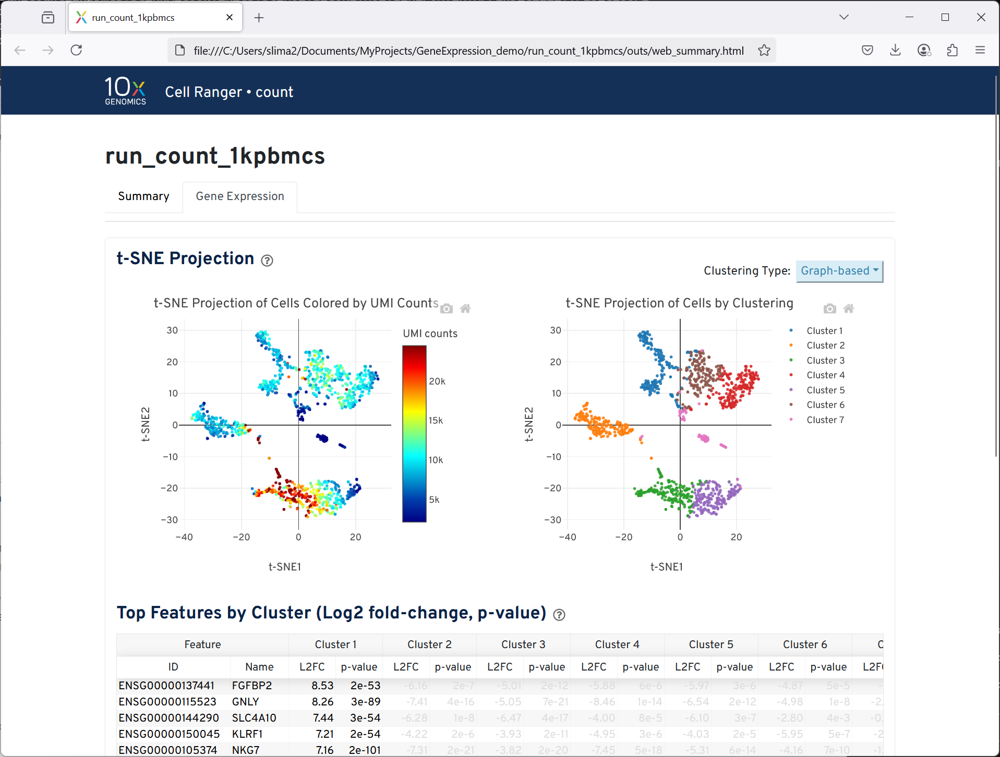

# CellRanger
Cell Ranger is a set of analysis pipelines that process Chromium single-cell RNA-seq output to align reads, generate gene-cell matrices and perform clustering and gene expression analysis.
It is a free software by 10X Genomics for processing single cell sequencing data (e.g. gene expression analysis). The results can be transfered and viewed on a personal workstation.

For convenience, sample datasets and reference genomes are provided in /common/data/cellranger.

## Contents
These are the files/directories included for this example
1. `cellranger.slurm` is the slurm batch submit script. User may have to change the account name based on what resources are available to them. 

## How to run
The following are steps to run our CellRanger example on either the Tinkercliffs or Owl clusters. This will give you access to all examples in our GitHub repo. Run these commands once you have logged into a cluster. 
Before you submit your batch script, you will need to change the account name to the account you have access to. This name can be found in your [ColdFront account](https://coldfront.arc.vt.edu/).
```
git clone https://github.com/AdvancedResearchComputing/examples.git
cd examples/cellranger
sbatch cellranger.slurm 
```

### Cluster and Partition Info
CellRanger is available on all ARC systems. 
In order to run on other clusters or different partitions make sure you are logged into the cluster of choice, and then change the partition name to the parition you would like to use.
The list of available resources and associated names of the paritions can be found in ARC's documentation [here](https://www.docs.arc.vt.edu/resources/compute.html). 

### Notes
Once you submit your slurm job, you are able to check the status of the job submission by typing `squeue`. 
For other slurm commands options please refer to [ARC's documentation](https://www.docs.arc.vt.edu/usage/more-slurm.html#more-slurm) on Slurm.
This batch script write the CellRanger output to a file named output.log.

This example follows the 10XGenomics tutorial for a simple gene expression analysis: https://www.10xgenomics.com/support/cn/software/cell-ranger/8.0/tutorials/cr-tutorial-ct



The CellRanger software documentation can be found [here](https://cellranger.dev/).

