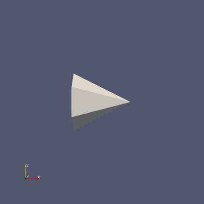

# ParaView
[ParaView](https://www.paraview.org/) is an open-source, multi-platform data analysis and visualization application. It’s especially popular in scientific computing and engineering for working with large-scale datasets.

## Contents
These are the files/directories included for this example
1. `paraview.slurm` is the slurm batch submit script. User may have to change the account name based on what resources are available to them. 
2. `pvcone.py` is the python script that runs ParaView to generate the cone image.
3. `pvcone_expected.png` is the expected image that the python script produces.


## How to run
The following are steps to run our ParaView example on our Falcon cluster. This will give you access to all examples in our GitHub repo. Run these commands once you have logged into a cluster. 
Before you submit your batch script, you will need to change the account name to the account you have access to. This name can be found in your [ColdFront account](https://coldfront.arc.vt.edu/).
```
git clone https://github.com/AdvancedResearchComputing/examples.git
cd examples/paraview
sbatch paraview.slurm 
```

### Cluster and Partition Info
ParaView is available on all ARC systems. 
In order to run on other clusters or different partitions make sure you are logged into the cluster of choice, and then change the partition name to the parition you would like to use.
The list of available resources and associated names of the paritions can be found in ARC's documentation [here](https://www.docs.arc.vt.edu/resources/compute.html). 

### Notes
Once you submit your slurm job, you are able to check the status of the job submission by typing `squeue`. 
For other slurm commands options please refer to [ARC's documentation](https://www.docs.arc.vt.edu/usage/more-slurm.html#more-slurm) on Slurm.

This python script generate an image file (.png) named pvcone.png. The image should look like the following: 


ARC offers many ways to run ParaView:
- Interactive sessions through [Open OnDemand](https://ood.arc.vt.edu/), where visualization is viewed and manipulated interactively.
- Offscreen batch scripting (e.g. using Python), where the results of the visualization are saved to image or video files.
- Using GPUs through client–server mode, by executing the pvserver program on one of ARC clusters with GPUs in parallel  and connect to it with the paraview client application.

We also provide more documentation and examples for using ParaView on [ARC's documentation site](https://docs.arc.vt.edu/software/paraview.html).
The ParaView software documentation can be found [here](https://www.paraview.org/).

